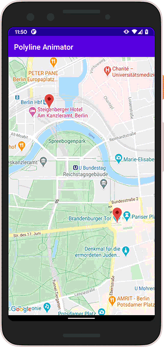
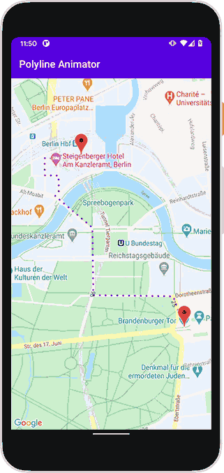

# PolylineAnimator
Android google maps polyline animator

A library that will provide an animated polyline object.

There is a [medium article](https://p72b.medium.com/polyline-animation-5decc9e964d4) explaining the algorithm implementation available.

## Import

1. Add it in your root build.gradle at the end of repositories:
```gradle
    allprojects {
        repositories {
            ...
            maven { url 'https://jitpack.io' }
        }
    }
 ```
2. Add the dependency
```gradle
    dependencies {
        implementation 'com.github.p72b:PolylineAnimator:0.1.3'
    }
 ```

## Implementation

Basic example
```kotlin
     override fun onMapReady(googleMap: GoogleMap) {
         mMap = googleMap

         val animatedPolyline = AnimatedPolyline(
                 mMap,
                 wayPoints
         )
         animatedPolyline.start()
     }
 ```
Styled with dotted line and callback to listen on animation events.
```kotlin
    override fun onMapReady(googleMap: GoogleMap) {
        mMap = googleMap

        val animatedPolyline = AnimatedPolyline(
                mMap,
                wayPoints,
                polylineOptions = PolylineOptions()
                                      .color(ContextCompat.getColor(this, R.color.colorPrimary))
                                      .pattern(
                                          listOf(
                                              Dot(), Gap(20F)
                                          )
                                      ),
                duration = 1250,
                interpolator = DecelerateInterpolator(),
                animatorListenerAdapter = object : AnimatorListenerAdapter() {
                                              override fun onAnimationEnd(animation: Animator) {
                                                  animatedPolyline.start() // e.g. endless animation
                                              }
                                          }
        )
        animatedPolyline.startWithDelay(1000)
    }
```

Library Dependencies:
- play-services-maps is consumed
- android-maps-utils 1.0.0

Benefits:
- lightweight small library
- fast native Polyline animation
- kotlin based code
- google maps polyline will be used e.g. none pixel based custom rendering

## Requirements

Library: No google API key is required. The library can be used starting at:
- MinSdk 21 (Android 5.0)

Demo App: Android google maps key is required. Runs on:
- MinSdk 21 (Android 5.0)

## Download

Check out the <a href="https://jitpack.io/#P72B/PolylineAnimator" download>lib version on JitPack</a>

## Library Sample App

To build the demo app there is an android google maps key needed. Place the key inside app/signing.properties file like this:
```
GOOGLE_MAPS_API_KEY=key_here
```

Example of demo app:

[default]
[custom styled]

Animation in video format <a href="https://github.com/P72B/PolylineAnimator/tree/main/assets">here</a>
